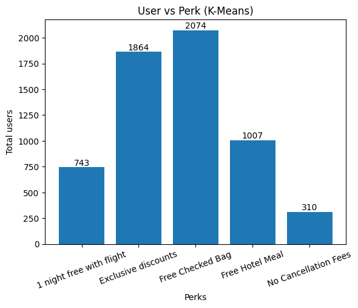

```python
import pandas as pd
from sklearn.preprocessing import StandardScaler # for scaling
from sklearn.cluster import KMeans # for clustering
```


```python
# load the dataset
segment_df = pd.read_csv('travelTide_customer_segmented_dataset-kmeans.csv')
segment_df
```


<div>
<style scoped>
    .dataframe tbody tr th:only-of-type {
        vertical-align: middle;
    }

    .dataframe tbody tr th {
        vertical-align: top;
    }

    .dataframe thead th {
        text-align: right;
    }
</style>
<table border="1" class="dataframe">
  <thead>
    <tr style="text-align: right;">
      <th></th>
      <th>user_id</th>
      <th>total_hotel_spent</th>
      <th>checked_bags</th>
      <th>no_cancelled_trip</th>
      <th>discounted_trip</th>
      <th>trip_with_return_flight</th>
    </tr>
  </thead>
  <tbody>
    <tr>
      <th>0</th>
      <td>534594</td>
      <td>28114.0</td>
      <td>0.0</td>
      <td>2</td>
      <td>0.0</td>
      <td>1.0</td>
    </tr>
    <tr>
      <th>1</th>
      <td>596863</td>
      <td>27489.0</td>
      <td>4.0</td>
      <td>3</td>
      <td>0.0</td>
      <td>1.0</td>
    </tr>
    <tr>
      <th>2</th>
      <td>507805</td>
      <td>27241.0</td>
      <td>6.0</td>
      <td>5</td>
      <td>1.0</td>
      <td>5.0</td>
    </tr>
    <tr>
      <th>3</th>
      <td>539710</td>
      <td>22619.0</td>
      <td>1.0</td>
      <td>4</td>
      <td>1.0</td>
      <td>3.0</td>
    </tr>
    <tr>
      <th>4</th>
      <td>669329</td>
      <td>22356.0</td>
      <td>0.0</td>
      <td>2</td>
      <td>0.0</td>
      <td>1.0</td>
    </tr>
    <tr>
      <th>...</th>
      <td>...</td>
      <td>...</td>
      <td>...</td>
      <td>...</td>
      <td>...</td>
      <td>...</td>
    </tr>
    <tr>
      <th>5993</th>
      <td>544926</td>
      <td>-349.0</td>
      <td>0.0</td>
      <td>3</td>
      <td>2.0</td>
      <td>3.0</td>
    </tr>
    <tr>
      <th>5994</th>
      <td>577534</td>
      <td>-398.0</td>
      <td>1.0</td>
      <td>1</td>
      <td>1.0</td>
      <td>1.0</td>
    </tr>
    <tr>
      <th>5995</th>
      <td>596320</td>
      <td>-477.0</td>
      <td>2.0</td>
      <td>2</td>
      <td>1.0</td>
      <td>1.0</td>
    </tr>
    <tr>
      <th>5996</th>
      <td>539868</td>
      <td>-562.0</td>
      <td>1.0</td>
      <td>3</td>
      <td>1.0</td>
      <td>2.0</td>
    </tr>
    <tr>
      <th>5997</th>
      <td>515835</td>
      <td>-575.0</td>
      <td>1.0</td>
      <td>3</td>
      <td>0.0</td>
      <td>3.0</td>
    </tr>
  </tbody>
</table>
<p>5998 rows × 6 columns</p>
</div>


```python
# sort the dataset according to user_id
segment_df = segment_df.sort_values('user_id', ascending = True)
```


```python
segment_df
```


<div>
<style scoped>
    .dataframe tbody tr th:only-of-type {
        vertical-align: middle;
    }

    .dataframe tbody tr th {
        vertical-align: top;
    }

    .dataframe thead th {
        text-align: right;
    }
</style>
<table border="1" class="dataframe">
  <thead>
    <tr style="text-align: right;">
      <th></th>
      <th>user_id</th>
      <th>total_hotel_spent</th>
      <th>checked_bags</th>
      <th>no_cancelled_trip</th>
      <th>discounted_trip</th>
      <th>trip_with_return_flight</th>
    </tr>
  </thead>
  <tbody>
    <tr>
      <th>863</th>
      <td>23557</td>
      <td>3802.0</td>
      <td>0.0</td>
      <td>2</td>
      <td>1.0</td>
      <td>0.0</td>
    </tr>
    <tr>
      <th>5178</th>
      <td>94883</td>
      <td>130.0</td>
      <td>1.0</td>
      <td>2</td>
      <td>0.0</td>
      <td>2.0</td>
    </tr>
    <tr>
      <th>1856</th>
      <td>101486</td>
      <td>2199.0</td>
      <td>0.0</td>
      <td>2</td>
      <td>0.0</td>
      <td>1.0</td>
    </tr>
    <tr>
      <th>1634</th>
      <td>101961</td>
      <td>2429.0</td>
      <td>2.0</td>
      <td>5</td>
      <td>1.0</td>
      <td>5.0</td>
    </tr>
    <tr>
      <th>117</th>
      <td>106907</td>
      <td>8514.0</td>
      <td>10.0</td>
      <td>1</td>
      <td>0.0</td>
      <td>1.0</td>
    </tr>
    <tr>
      <th>...</th>
      <td>...</td>
      <td>...</td>
      <td>...</td>
      <td>...</td>
      <td>...</td>
      <td>...</td>
    </tr>
    <tr>
      <th>5151</th>
      <td>792549</td>
      <td>144.0</td>
      <td>2.0</td>
      <td>4</td>
      <td>0.0</td>
      <td>1.0</td>
    </tr>
    <tr>
      <th>2984</th>
      <td>796032</td>
      <td>1261.0</td>
      <td>5.0</td>
      <td>3</td>
      <td>1.0</td>
      <td>2.0</td>
    </tr>
    <tr>
      <th>3704</th>
      <td>801660</td>
      <td>872.0</td>
      <td>1.0</td>
      <td>3</td>
      <td>1.0</td>
      <td>3.0</td>
    </tr>
    <tr>
      <th>3742</th>
      <td>811077</td>
      <td>852.0</td>
      <td>0.0</td>
      <td>1</td>
      <td>0.0</td>
      <td>1.0</td>
    </tr>
    <tr>
      <th>5965</th>
      <td>844489</td>
      <td>0.0</td>
      <td>0.0</td>
      <td>0</td>
      <td>0.0</td>
      <td>0.0</td>
    </tr>
  </tbody>
</table>
<p>5998 rows × 6 columns</p>
</div>


```python
# Select relevant metrics for clustering
metrics = ['total_hotel_spent', 'checked_bags', 'no_cancelled_trip', 'discounted_trip', 'trip_with_return_flight']
X = segment_df[metrics]
```


```python
X
```


<div>
<style scoped>
    .dataframe tbody tr th:only-of-type {
        vertical-align: middle;
    }

    .dataframe tbody tr th {
        vertical-align: top;
    }

    .dataframe thead th {
        text-align: right;
    }
</style>
<table border="1" class="dataframe">
  <thead>
    <tr style="text-align: right;">
      <th></th>
      <th>total_hotel_spent</th>
      <th>checked_bags</th>
      <th>no_cancelled_trip</th>
      <th>discounted_trip</th>
      <th>trip_with_return_flight</th>
    </tr>
  </thead>
  <tbody>
    <tr>
      <th>863</th>
      <td>3802.0</td>
      <td>0.0</td>
      <td>2</td>
      <td>1.0</td>
      <td>0.0</td>
    </tr>
    <tr>
      <th>5178</th>
      <td>130.0</td>
      <td>1.0</td>
      <td>2</td>
      <td>0.0</td>
      <td>2.0</td>
    </tr>
    <tr>
      <th>1856</th>
      <td>2199.0</td>
      <td>0.0</td>
      <td>2</td>
      <td>0.0</td>
      <td>1.0</td>
    </tr>
    <tr>
      <th>1634</th>
      <td>2429.0</td>
      <td>2.0</td>
      <td>5</td>
      <td>1.0</td>
      <td>5.0</td>
    </tr>
    <tr>
      <th>117</th>
      <td>8514.0</td>
      <td>10.0</td>
      <td>1</td>
      <td>0.0</td>
      <td>1.0</td>
    </tr>
    <tr>
      <th>...</th>
      <td>...</td>
      <td>...</td>
      <td>...</td>
      <td>...</td>
      <td>...</td>
    </tr>
    <tr>
      <th>5151</th>
      <td>144.0</td>
      <td>2.0</td>
      <td>4</td>
      <td>0.0</td>
      <td>1.0</td>
    </tr>
    <tr>
      <th>2984</th>
      <td>1261.0</td>
      <td>5.0</td>
      <td>3</td>
      <td>1.0</td>
      <td>2.0</td>
    </tr>
    <tr>
      <th>3704</th>
      <td>872.0</td>
      <td>1.0</td>
      <td>3</td>
      <td>1.0</td>
      <td>3.0</td>
    </tr>
    <tr>
      <th>3742</th>
      <td>852.0</td>
      <td>0.0</td>
      <td>1</td>
      <td>0.0</td>
      <td>1.0</td>
    </tr>
    <tr>
      <th>5965</th>
      <td>0.0</td>
      <td>0.0</td>
      <td>0</td>
      <td>0.0</td>
      <td>0.0</td>
    </tr>
  </tbody>
</table>
<p>5998 rows × 5 columns</p>
</div>


```python
# Standardize the data
scaler = StandardScaler()
X_scaled = scaler.fit_transform(X)
```


```python
X_scaled
```


    array([[ 0.79305145, -0.97483371, -0.44893115,  0.36429641, -1.34872558],
           [-0.77913349, -0.28377443, -0.44893115, -0.87229095,  0.07626227],
           [ 0.10671908, -0.97483371, -0.44893115, -0.87229095, -0.63623165],
           ...,
           [-0.46144252, -0.28377443,  0.20846364,  0.36429641,  0.78875619],
           [-0.47000562, -0.97483371, -1.10632594, -0.87229095, -0.63623165],
           [-0.83479363, -0.97483371, -1.76372072, -0.87229095, -1.34872558]])


```python
# Apply K-means clustering
num_clusters = 5  # Number of clusters
kmeans = KMeans(n_clusters=num_clusters, random_state=42)
segment_df['cluster'] = kmeans.fit_predict(X_scaled)
```

    C:\Python311\Lib\site-packages\sklearn\cluster\_kmeans.py:870: FutureWarning: The default value of `n_init` will change from 10 to 'auto' in 1.4. Set the value of `n_init` explicitly to suppress the warning
      warnings.warn(
    


```python
# Assign perks based on cluster
def assign_perk(cluster_id):
    if cluster_id == 0:
        return 'Free Hotel Meal'
    elif cluster_id == 1:
        return 'Free Checked Bag'
    elif cluster_id == 2:
        return 'No Cancellation Fees'
    elif cluster_id == 3:
        return 'Exclusive discounts'
    elif cluster_id == 4:
        return '1 night free with flight'

segment_df['perk'] = segment_df['cluster'].apply(assign_perk)
```


```python
# see the assigned cluster
segment_df[['user_id', 'cluster', 'perk']]
```


<div>
<style scoped>
    .dataframe tbody tr th:only-of-type {
        vertical-align: middle;
    }

    .dataframe tbody tr th {
        vertical-align: top;
    }

    .dataframe thead th {
        text-align: right;
    }
</style>
<table border="1" class="dataframe">
  <thead>
    <tr style="text-align: right;">
      <th></th>
      <th>user_id</th>
      <th>cluster</th>
      <th>perk</th>
    </tr>
  </thead>
  <tbody>
    <tr>
      <th>863</th>
      <td>23557</td>
      <td>3</td>
      <td>Exclusive discounts</td>
    </tr>
    <tr>
      <th>5178</th>
      <td>94883</td>
      <td>1</td>
      <td>Free Checked Bag</td>
    </tr>
    <tr>
      <th>1856</th>
      <td>101486</td>
      <td>3</td>
      <td>Exclusive discounts</td>
    </tr>
    <tr>
      <th>1634</th>
      <td>101961</td>
      <td>0</td>
      <td>Free Hotel Meal</td>
    </tr>
    <tr>
      <th>117</th>
      <td>106907</td>
      <td>2</td>
      <td>No Cancellation Fees</td>
    </tr>
    <tr>
      <th>...</th>
      <td>...</td>
      <td>...</td>
      <td>...</td>
    </tr>
    <tr>
      <th>5151</th>
      <td>792549</td>
      <td>1</td>
      <td>Free Checked Bag</td>
    </tr>
    <tr>
      <th>2984</th>
      <td>796032</td>
      <td>0</td>
      <td>Free Hotel Meal</td>
    </tr>
    <tr>
      <th>3704</th>
      <td>801660</td>
      <td>1</td>
      <td>Free Checked Bag</td>
    </tr>
    <tr>
      <th>3742</th>
      <td>811077</td>
      <td>3</td>
      <td>Exclusive discounts</td>
    </tr>
    <tr>
      <th>5965</th>
      <td>844489</td>
      <td>3</td>
      <td>Exclusive discounts</td>
    </tr>
  </tbody>
</table>
<p>5998 rows × 3 columns</p>
</div>


```python
segment_df
```


<div>
<style scoped>
    .dataframe tbody tr th:only-of-type {
        vertical-align: middle;
    }

    .dataframe tbody tr th {
        vertical-align: top;
    }

    .dataframe thead th {
        text-align: right;
    }
</style>
<table border="1" class="dataframe">
  <thead>
    <tr style="text-align: right;">
      <th></th>
      <th>user_id</th>
      <th>total_hotel_spent</th>
      <th>checked_bags</th>
      <th>no_cancelled_trip</th>
      <th>discounted_trip</th>
      <th>trip_with_return_flight</th>
      <th>cluster</th>
      <th>perk</th>
    </tr>
  </thead>
  <tbody>
    <tr>
      <th>863</th>
      <td>23557</td>
      <td>3802.0</td>
      <td>0.0</td>
      <td>2</td>
      <td>1.0</td>
      <td>0.0</td>
      <td>3</td>
      <td>Exclusive discounts</td>
    </tr>
    <tr>
      <th>5178</th>
      <td>94883</td>
      <td>130.0</td>
      <td>1.0</td>
      <td>2</td>
      <td>0.0</td>
      <td>2.0</td>
      <td>1</td>
      <td>Free Checked Bag</td>
    </tr>
    <tr>
      <th>1856</th>
      <td>101486</td>
      <td>2199.0</td>
      <td>0.0</td>
      <td>2</td>
      <td>0.0</td>
      <td>1.0</td>
      <td>3</td>
      <td>Exclusive discounts</td>
    </tr>
    <tr>
      <th>1634</th>
      <td>101961</td>
      <td>2429.0</td>
      <td>2.0</td>
      <td>5</td>
      <td>1.0</td>
      <td>5.0</td>
      <td>0</td>
      <td>Free Hotel Meal</td>
    </tr>
    <tr>
      <th>117</th>
      <td>106907</td>
      <td>8514.0</td>
      <td>10.0</td>
      <td>1</td>
      <td>0.0</td>
      <td>1.0</td>
      <td>2</td>
      <td>No Cancellation Fees</td>
    </tr>
    <tr>
      <th>...</th>
      <td>...</td>
      <td>...</td>
      <td>...</td>
      <td>...</td>
      <td>...</td>
      <td>...</td>
      <td>...</td>
      <td>...</td>
    </tr>
    <tr>
      <th>5151</th>
      <td>792549</td>
      <td>144.0</td>
      <td>2.0</td>
      <td>4</td>
      <td>0.0</td>
      <td>1.0</td>
      <td>1</td>
      <td>Free Checked Bag</td>
    </tr>
    <tr>
      <th>2984</th>
      <td>796032</td>
      <td>1261.0</td>
      <td>5.0</td>
      <td>3</td>
      <td>1.0</td>
      <td>2.0</td>
      <td>0</td>
      <td>Free Hotel Meal</td>
    </tr>
    <tr>
      <th>3704</th>
      <td>801660</td>
      <td>872.0</td>
      <td>1.0</td>
      <td>3</td>
      <td>1.0</td>
      <td>3.0</td>
      <td>1</td>
      <td>Free Checked Bag</td>
    </tr>
    <tr>
      <th>3742</th>
      <td>811077</td>
      <td>852.0</td>
      <td>0.0</td>
      <td>1</td>
      <td>0.0</td>
      <td>1.0</td>
      <td>3</td>
      <td>Exclusive discounts</td>
    </tr>
    <tr>
      <th>5965</th>
      <td>844489</td>
      <td>0.0</td>
      <td>0.0</td>
      <td>0</td>
      <td>0.0</td>
      <td>0.0</td>
      <td>3</td>
      <td>Exclusive discounts</td>
    </tr>
  </tbody>
</table>
<p>5998 rows × 8 columns</p>
</div>


```python
# save the segmented dataset
segment_df[['user_id', 'perk']].to_csv('travelTide_customer_segmented_dataset-kmeans-applied.csv', index=False)
```


```python
import matplotlib.pyplot as plt # for plotting
```


```python
# Group by 'perk' column and count rows in each group
grouped = segment_df.groupby('perk').size().reset_index(name='Count')

# Create a bar plot
plt.bar(grouped['perk'], grouped['Count'])
plt.xlabel('Perks')
plt.ylabel('Total users')
plt.title('User vs Perk (K-Means)')
plt.xticks(rotation=20)

# Add value labels on top of bars
for i, value in enumerate(grouped['Count']):
    plt.text(i, value + 0.1, str(value), ha='center', va='bottom', fontsize=10)

    
plt.show()
```


    

    


```python
grouped
```


<div>
<style scoped>
    .dataframe tbody tr th:only-of-type {
        vertical-align: middle;
    }

    .dataframe tbody tr th {
        vertical-align: top;
    }

    .dataframe thead th {
        text-align: right;
    }
</style>
<table border="1" class="dataframe">
  <thead>
    <tr style="text-align: right;">
      <th></th>
      <th>perk</th>
      <th>Count</th>
    </tr>
  </thead>
  <tbody>
    <tr>
      <th>0</th>
      <td>1 night free with flight</td>
      <td>743</td>
    </tr>
    <tr>
      <th>1</th>
      <td>Exclusive discounts</td>
      <td>1864</td>
    </tr>
    <tr>
      <th>2</th>
      <td>Free Checked Bag</td>
      <td>2074</td>
    </tr>
    <tr>
      <th>3</th>
      <td>Free Hotel Meal</td>
      <td>1007</td>
    </tr>
    <tr>
      <th>4</th>
      <td>No Cancellation Fees</td>
      <td>310</td>
    </tr>
  </tbody>
</table>
</div>


```python

```
